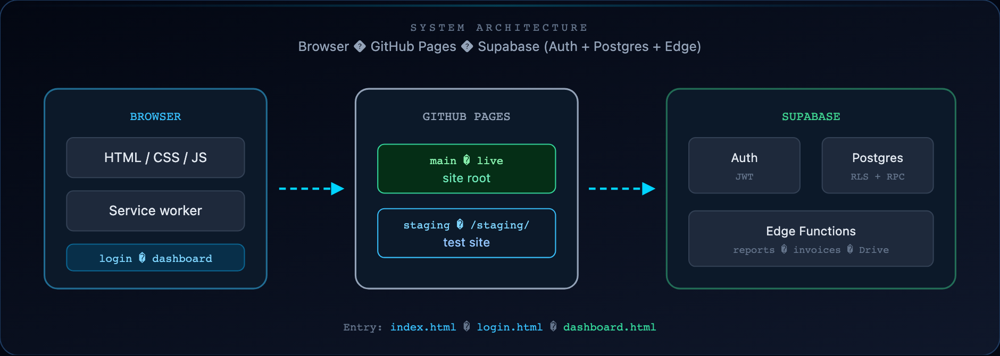
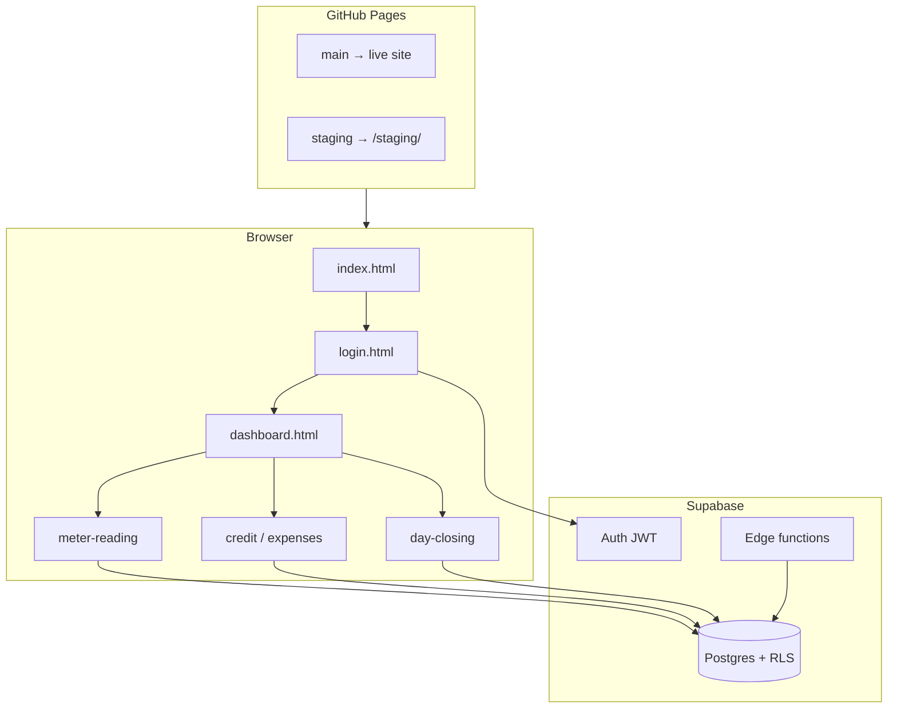
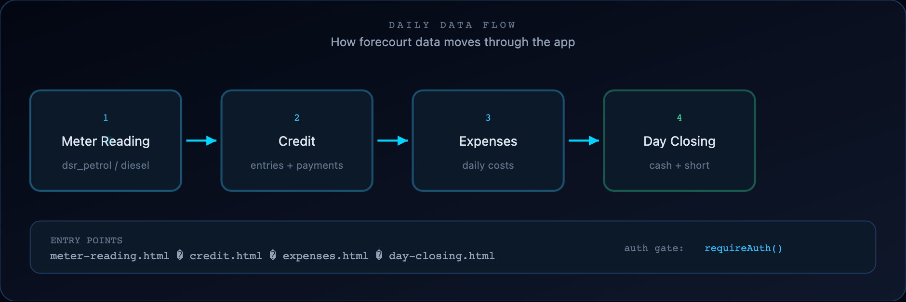
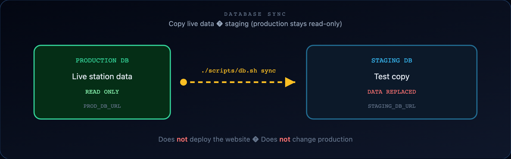
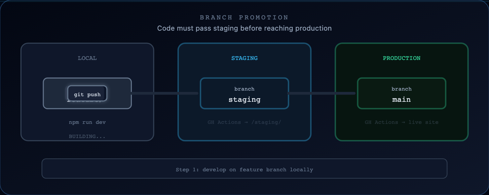
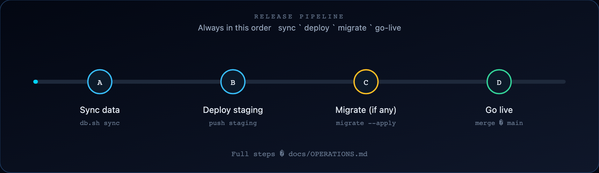
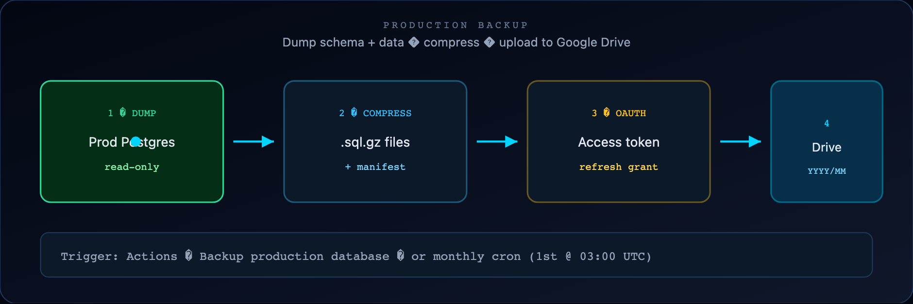

<div align="center">


# Bishnupriya Fuels

### A F&amp;S Ventures Company · BPCL fuel station ops


<br />

[](https://github.com/fnsventures/petrolpump/stargazers)
[](https://github.com/fnsventures/petrolpump/commits/main)
[](https://github.com/fnsventures/petrolpump/actions)
[](https://github.com/fnsventures/petrolpump)
[](https://github.com/fnsventures/petrolpump)

<br />

[](docs/ARCHITECTURE.md)
[](docs/ARCHITECTURE.md)
[](docs/ARCHITECTURE.md)
[](docs/DATA_TABLES.md)
[](docs/OPERATIONS.md)
[](docs/OPERATIONS.md)

<br />

### Built with

<a href="docs/ARCHITECTURE.md">
  
</a>

<br /><br />

<a href="https://github.com/fnsventures/petrolpump">
  
</a>

<br />


<br />

**Live:** `main` · **Test:** `staging` → `/staging/` · **Site:** [bishnupriyafuels.fnsventures.in](https://bishnupriyafuels.fnsventures.in)


</div>

## Menu

- [Welcome](#welcome)
- [Repo pulse](#repo-pulse)
- [Visual tour](#visual-tour)
  - [Architecture](#1-architecture--entry-points)
  - [Data flow](#2-daily-data-flow)
  - [Sync staging](#3-sync-staging-with-production-data)
  - [Deploy & release](#4-deploy--release)
  - [Backup](#5-production-backup--google-drive)
- [Ship checklist](#do-this-when-you-ship)
- [Run locally](#run-locally)
- [Docs map](#documentation-map)


## Welcome

<div align="center">


<br />

Daily operations, finance, and HR for a BPCL fuel station.

| | |
|--|--|
| **Stack** | HTML/JS · Supabase · GitHub Pages |
| **Roles** | `admin` · `supervisor` |
| **Ship guide** | **[docs/OPERATIONS.md](docs/OPERATIONS.md)** |


</div>


## Repo pulse

Interactive widgets from the [awesome GitHub profile README](https://github.com/abhisheknaiidu/awesome-github-profile-readme) toolkit — kept to what fits a **project** repo (not personal streaks/Spotify).

<div align="center">

| Widget | Source |
|--------|--------|
| Typing headline | [readme-typing-svg](https://github.com/DenverCoder1/readme-typing-svg) |
| Skill icons | [skillicons.dev](https://skillicons.dev) |
| Repo card | [gh-card.dev](https://gh-card.dev) |
| Status badges | [Shields.io](https://shields.io) |
| Visitor count | visitor-badge |

<br />


<br />

```text
feature  →  staging (/staging/)  →  migrate (if needed)  →  main (live)
                ↑
         ./scripts/db.sh sync   (data only — not a deploy)
```

</div>


## Visual tour

<div align="center">


<br />

Diagrams are **PNG** (GitHub blocks most SVGs). Written steps live in [OPERATIONS.md](docs/OPERATIONS.md).

</div>

### 1. Architecture & entry points

<div align="center">

</div>

<p align="center">
  
</p>



**Entry:** `index.html` → `login.html` → `dashboard.html` (after Auth + `public.users` role).


### 2. Daily data flow

<div align="center">

</div>

<p align="center">
  
</p>

| Step | Page | Writes |
|------|------|--------|
| 1 | `meter-reading.html` | `dsr_petrol` / `dsr_diesel` |
| 2 | `credit.html` | credit entries & payments |
| 3 | `expenses.html` | expenses |
| 4 | `day-closing.html` | day closing + night-cash collection |

Deep dive: [docs/FLOWS.md](docs/FLOWS.md)


### 3. Sync staging with production data

<div align="center">

</div>

<p align="center">
  
</p>

```bash
./scripts/db.sh sync
```

Production is **read-only**. Staging data is **replaced**. This does **not** deploy the website.

Steps: [OPERATIONS §1](docs/OPERATIONS.md#1-sync-staging-with-production-data)


### 4. Deploy & release

<div align="center">

</div>

<p align="center">
  
</p>

<p align="center">
  
</p>

| Step | Action | Command / trigger |
|------|--------|-------------------|
| **A** | Sync data (optional) | `./scripts/db.sh sync` |
| **B** | Deploy test site | Push / merge to `staging` |
| **C** | DB migrate (only if needed) | `./scripts/db.sh migrate` then `--apply` |
| **D** | Go live | Merge `staging` → `main` |

Full checklist: [OPERATIONS §2–3](docs/OPERATIONS.md#2-deploy-the-website-to-staging)


### 5. Production backup → Google Drive

<div align="center">

</div>

<p align="center">
  
</p>

```text
GitHub Actions → Backup production database → Drive folder YYYY/YYYY-MM/
```

Or locally: `./scripts/db.sh backup` · `./scripts/backup-prod-to-drive.sh`

Steps: [OPERATIONS §4](docs/OPERATIONS.md#4-backup-production-database)


## Do this when you ship

<div align="center">


### → [docs/OPERATIONS.md](docs/OPERATIONS.md)

</div>

| I want to… | Go to |
|------------|-------|
| Copy live data into staging | §1 Sync |
| Publish `/staging/` | §2 Deploy |
| Release to production | §3 Release |
| Back up the live DB | §4 Backup |


## Run locally

```bash
cp js/env.example.js js/env.js   # Supabase URL + anon key
npm run dev                      # http://localhost:3000
```

Provision Auth **and** `public.users` as `admin` — see [docs/DEVELOPMENT.md](docs/DEVELOPMENT.md).

## Features

| Area | Covers |
|------|--------|
| Meter reading / DSR | MS/HSD readings and stock |
| Credit | Ledger, FIFO payments, prepaid, outstanding |
| Day closing | Night cash, phone pay, short, cash collection |
| Billing / invoices | Outward GST · inward supplier PDFs (Drive) |
| Expenses · HR · Reports | Costs, attendance, salary, admin reports |

## Documentation map

| Document | Purpose |
|----------|---------|
| [**Operations playbook**](docs/OPERATIONS.md) | Sync · deploy · release · backup |
| [Documentation hub](docs/README.md) | Index |
| [Architecture](docs/ARCHITECTURE.md) | Folders, security, stack |
| [Flows](docs/FLOWS.md) | Page → data journeys |
| [Development](docs/DEVELOPMENT.md) | First-time setup |
| [Backup (deep)](docs/BACKUP.md) | Restore & Drive troubleshooting |
| [Invoice documents](docs/INVOICE_DOCUMENTS.md) | Supplier PDFs → Drive |

---

<div align="center">


<br />

<sub>Static HTML/JS · Supabase · GitHub Pages · service worker</sub>

<br />

GIF style inspired by [Cool-GIFs-For-GitHub](https://github.com/Anmol-Baranwal/Cool-GIFs-For-GitHub) · interactive widgets from [awesome-github-profile-readme](https://github.com/abhisheknaiidu/awesome-github-profile-readme) (typing · skillicons · shields · gh-card)

</div>
