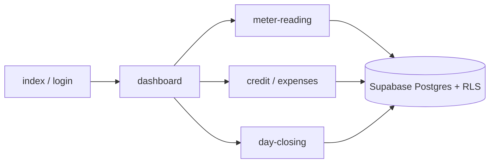

<div align="center">

# Bishnupriya Fuels

### A F&amp;S Ventures Company · BPCL fuel station ops

[](docs/ARCHITECTURE.md)
[](docs/OPERATIONS.md)
[](docs/OPERATIONS.md)

<br />


<br />

**Live:** `main` · **Test:** `staging` → `/staging/` · **Domain:** [bishnupriyafuels.fnsventures.in](https://bishnupriyafuels.fnsventures.in)

</div>

---

## Visual tour

*Animations play on GitHub (open this README on github.com). Click any title for the written steps.*

### 1. Architecture & entry points

<p align="center">
  
</p>



**Entry:** `index.html` → `login.html` → `dashboard.html` (after Auth + `public.users` role).

---

### 2. Daily data flow

<p align="center">
  
</p>

| Step | Page | Writes |
|------|------|--------|
| 1 | `meter-reading.html` | `dsr_petrol` / `dsr_diesel` |
| 2 | `credit.html` | credit entries & payments |
| 3 | `expenses.html` | expenses |
| 4 | `day-closing.html` | day closing + night-cash collection |

Deep dive: [docs/FLOWS.md](docs/FLOWS.md)

---

### 3. Sync staging with production data

<p align="center">
  
</p>

```bash
./scripts/db.sh sync
```

Production is **read-only**. Staging data is **replaced**. This does **not** deploy the website.

Steps: [OPERATIONS §1](docs/OPERATIONS.md#1-sync-staging-with-production-data)

---

### 4. Deploy & release

<p align="center">
  
</p>

<p align="center">
  
</p>

| Step | Action | Command / trigger |
|------|--------|-------------------|
| **A** | Sync data (optional) | `./scripts/db.sh sync` |
| **B** | Deploy test site | Push / merge to `staging` |
| **C** | DB migrate (only if needed) | `./scripts/db.sh migrate` then `--apply` |
| **D** | Go live | Merge `staging` → `main` |

Full checklist: [OPERATIONS §2–3](docs/OPERATIONS.md#2-deploy-the-website-to-staging)

---

### 5. Production backup → Google Drive

<p align="center">
  
</p>

```text
GitHub Actions → Backup production database → Drive folder YYYY/YYYY-MM/
```

Or locally: `./scripts/db.sh backup` (laptop only) · `./scripts/backup-prod-to-drive.sh` (Drive).

Steps: [OPERATIONS §4](docs/OPERATIONS.md#4-backup-production-database)

---

## Do this when you ship

Open the playbook — numbered steps, no fluff:

### → [docs/OPERATIONS.md](docs/OPERATIONS.md)

| I want to… | Go to |
|------------|-------|
| Copy live data into staging | §1 Sync |
| Publish `/staging/` | §2 Deploy |
| Release to production | §3 Release |
| Back up the live DB | §4 Backup |

---

## Run locally

```bash
cp js/env.example.js js/env.js   # Supabase URL + anon key
npm run dev                      # http://localhost:3000
```

Provision Auth **and** `public.users` as `admin` — see [docs/DEVELOPMENT.md](docs/DEVELOPMENT.md).

---

## Features

| Area | Covers |
|------|--------|
| Meter reading / DSR | MS/HSD readings and stock |
| Credit | Ledger, FIFO payments, prepaid, outstanding |
| Day closing | Night cash, phone pay, short, cash collection |
| Billing / invoices | Outward GST · inward supplier PDFs (Drive) |
| Expenses · HR · Reports | Costs, attendance, salary, admin reports |

---

## Documentation map

| Document | Purpose |
|----------|---------|
| [**Operations playbook**](docs/OPERATIONS.md) | Sync · deploy · release · backup |
| [Documentation hub](docs/README.md) | Index + visual links |
| [Architecture](docs/ARCHITECTURE.md) | Folders, security, stack |
| [Flows](docs/FLOWS.md) | Page → data journeys |
| [Development](docs/DEVELOPMENT.md) | First-time setup |
| [Backup (deep)](docs/BACKUP.md) | Restore & Drive troubleshooting |
| [Invoice documents](docs/INVOICE_DOCUMENTS.md) | Supplier PDFs → Drive |

<div align="center">

<br />

<sub>Static HTML/JS · Supabase · GitHub Pages · service worker</sub>

</div>
