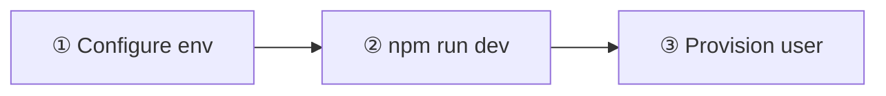
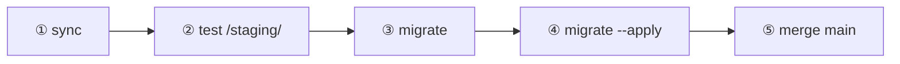

<div align="center">

# Documentation Hub

**Bishnupriya Fuels** — run locally · deploy safely · ship releases

<br />


<br />

[Quick start](#-quick-start) · [Daily tasks](#-daily--weekly) · [Release](#-release--maintenance) · [Commands](#-command-recipes) · [Cheat sheet](#-cheat-sheet) · [Library](#-documentation-library)

</div>

---

## System snapshot

| | |
|:--|:--|
| **Stack** | Static HTML/JS · Supabase (Postgres + Auth + RLS) · GitHub Pages |
| **Production** | `main` branch → site root |
| **Staging** | `staging` branch → `/staging/` |
| **Roles** | `admin` (full) · `supervisor` (operations — no staff / settings / reports) |
| **Schema** | `supabase/schema.sql` (canonical) |

---

## Quick start



| Step | Action | Time |
|:--:|:--|:--:|
| **1** | `cp js/env.example.js js/env.js` → paste Supabase URL + anon key | ~2 min |
| **2** | `npm run dev` → open `http://localhost:4173` | ~1 min |
| **3** | Create Supabase Auth user **and** `public.users` row | ~3 min |

<details>
<summary><strong>① Configure — Supabase credentials</strong></summary>

<br />

```bash
cp js/env.example.js js/env.js
```

Edit `js/env.js`:

```javascript
window.__APP_CONFIG__ = {
  SUPABASE_URL: "https://your-project-id.supabase.co",
  SUPABASE_ANON_KEY: "your-anon-key-here",
  APP_ENV: "development",
};
```

| Where | What |
|:--|:--|
| Supabase → **Project Settings → API** | Project URL + anon key |
| SQL Editor | Run `supabase/schema.sql` or migrations in filename order |

> **Expected:** App connects without CORS errors.

</details>

<details>
<summary><strong>② Run — dev server</strong></summary>

<br />

**Recommended** (builds partials, mirrors production):

```bash
npm run dev
```

→ **http://localhost:4173/**

**Alternative:**

```bash
npm run build:site   # optional
python3 -m http.server 3000
```

→ **http://localhost:3000/login.html**

> **Tip:** Hard-refresh or unregister `sw.js` if assets look stale.

</details>

<details>
<summary><strong>③ Provision — first login</strong></summary>

<br />

> **Auth alone is not enough.** Both steps are required.

1. **Supabase Auth** → Authentication → Users → create email/password
2. **`public.users`** → add matching email:

```sql
insert into public.users (email, role)
values ('you@example.com', 'admin')
on conflict (email) do update set role = 'admin';
```

| Scenario | What happens |
|:--|:--|
| **Greenfield** | First user can self-provision as `admin` via Settings → Users |
| **Unprovisioned** | Can sign in but sees empty data — RLS blocks access |

→ [Development → First login](DEVELOPMENT.md#14-first-login)

</details>

---

## Quick access

### Daily & weekly

| Task | Command / link | Frequency |
|:--|:--|:--:|
| Run app locally | `npm run dev` |  |
| Deploy to staging | Push `staging` or [manual deploy ↓](#deploy-to-staging) |  |
| Add a supervisor | [Add operator ↓](#add-a-supervisor-operator) | as needed |
| Understand a feature | [Flows](FLOWS.md) | reference |

### Release & maintenance

| Task | Command / link | Frequency |
|:--|:--|:--:|
| **Full release workflow** | [Pipeline ↓](#release-workflow-ship-to-production) |  |
| Copy prod → staging | `./scripts/db.sh sync` |  |
| Check migrations (safe) | `./scripts/db.sh migrate` |  |
| Apply prod schema | `./scripts/db.sh migrate --apply` |  |
| Backup prod locally | `./scripts/db.sh backup` | before risky ops |
| Deploy production | Merge `staging` → `main` |  |

### One-time setup

| Task | Guide |
|:--|:--|
| Supplier invoices + Google Drive | [Invoice documents](INVOICE_DOCUMENTS.md) |
| Monthly prod DB → Google Drive | [Backup guide](BACKUP.md) |
| GitHub Pages + secrets | [Development → Deployment](DEVELOPMENT.md#2-deployment-prod-and-staging) |
| DB script credentials | [scripts/README.md](../scripts/README.md#one-time-setup) |

### Reference

| Topic | Document |
|:--|:--|
| Project structure, security | [Architecture](ARCHITECTURE.md) |
| Tables, RLS, RPCs | [Data tables](DATA_TABLES.md) |
| DSR / stock model | [DSR tables](DSR_TABLES.md) |
| User & data flows | [Flows](FLOWS.md) |

---

## Release workflow (ship to production)



| # | Command | Prod | Staging |
|:-:|:--|:--|:--|
| 1 | `./scripts/db.sh sync` | read only | data **replaced** |
| 2 | push `staging` → auto-deploy | — | updated |
| 3 | `./scripts/db.sh migrate` | no changes | — |
| 4 | `./scripts/db.sh migrate --apply` | schema upgraded | — |
| 5 | merge `staging` → `main` | site updated | — |

> **Before step 4:** optional `./scripts/db.sh backup` or Supabase Dashboard backup.  
> **Quiet window:** run step 4 when no DSR / day-closing entries are in progress.

→ [scripts/README → Release workflow](../scripts/README.md#release-workflow)

---

## Command recipes

> **DB setup (once):** `cp scripts/db.env.example scripts/db.env` — add pooler URIs from Supabase → Connect.

---

### Deploy to staging

 

| | |
|:--|:--|
| **URL** | `/staging/` |
| **Trigger** | Push `staging` **or** Actions → Deploy → target `staging` |

**Automatic**

1. Merge or push into `staging`
2. GitHub Actions deploys (~1–2 min)
3. Smoke-test on `/staging/`

**Manual**

1. Actions → **Deploy** → **Run workflow**
2. **Use workflow from** — your branch
3. **target** — `staging`
4. **ref** *(optional)* — commit SHA; empty = branch HEAD

**Requires:** `staging` secrets `SUPABASE_URL`, `SUPABASE_ANON_KEY`

---

### Deploy to production

 

| | |
|:--|:--|
| **URL** | site root |
| **Trigger** | Push `main` **or** manual Deploy → target `prod` |

1. Confirm `/staging/` tests pass
2. Merge `staging` → `main`
3. Wait for workflow
4. Smoke-test: login → dashboard → one operational page

> If release includes DB migrations, run [migrate --apply](#db-migrate-apply-production) during a **quiet window** before users enter DSR data.

---

### DB sync (prod → staging)

 

```bash
./scripts/db.sh sync
```

| Step | What happens |
|:--:|:--|
| 1 | Stamp staging migrations + `db push` |
| 2 | Dump prod auth, public, storage |
| 3 | Truncate staging |
| 4 | Load dumps; split legacy `dsr` if needed |

**Requires:** `scripts/db.env`, Docker (or `libpq`)  
**Output:** `scripts/.sync-dumps/` (gitignored)  
**Not copied:** storage file bytes, session tokens, edge secrets

---

### DB migrate (preflight)


```bash
./scripts/db.sh migrate
```

Shows migration status + dry-run. **Safe anytime.** Review output, then → [migrate --apply](#db-migrate-apply-production).

---

### DB migrate --apply (production)


```bash
./scripts/db.sh migrate --apply
```

| Step | Action |
|:--:|:--|
| 1 | Preflight SQL + migration counts |
| 2 | Dry-run |
| 3 | Auto-backup → `scripts/.prod-backups/` |
| 4 | `supabase db push` on prod |
| 5 | Verification SQL + DSR snapshot |

> **Quiet window only.** Do **not** run `stamp-staging-migrations.sql` on prod.

---

### DB backup (local)


```bash
./scripts/db.sh backup
```

→ `scripts/.prod-backups/` — `prod-schema-*.sql`, `prod-data-*.sql`, `dsr-counts-snapshot-*.txt`

Off-site: [Backup guide](BACKUP.md) (monthly Google Drive)

---

### Add a supervisor (operator)

1. **Supabase Auth** — create email + password
2. **Provision** — Settings → Users, or:

```sql
insert into public.users (email, role)
values ('operator@example.com', 'supervisor')
on conflict (email) do update set role = 'supervisor';
```

3. **Login** at `login.html`

| Can access | Cannot access |
|:--|:--|
| dashboard, DSR, credit, expenses, day closing, billing, invoices, attendance, salary | staff, analysis, reports, settings |

→ [Development → Supervisor login](DEVELOPMENT.md#3-supervisor--operator-login)

---

## Cheat sheet

| Goal | Command |
|:--|:--|
| Run locally | `npm run dev` |
| Build site mirror | `npm run build:site` |
| Sync prod → staging | `./scripts/db.sh sync` |
| Preflight migrations | `./scripts/db.sh migrate` |
| Apply prod migrations | `./scripts/db.sh migrate --apply` |
| Local prod backup | `./scripts/db.sh backup` |
| All DB commands | `./scripts/db.sh help` |
| Deploy edge function | `supabase functions deploy <name> --project-ref REF` |

---

## Documentation library

| Document | Best for |
|:--|:--|
| [**Architecture**](ARCHITECTURE.md) | Stack, folders, security, deployment |
| [**Flows**](FLOWS.md) | Page → table mapping, end-to-end behaviour |
| [**Development**](DEVELOPMENT.md) | Full setup, GitHub secrets, edge functions |
| [**Data tables**](DATA_TABLES.md) | Tables, columns, RLS, RPCs |
| [**DSR tables**](DSR_TABLES.md) | Meter readings, stock reconciliation |
| [**Invoice documents**](INVOICE_DOCUMENTS.md) | Google Drive setup (one-time) |
| [**Backup**](BACKUP.md) | Monthly Drive backup, restore |
| [**scripts/README**](../scripts/README.md) | DB scripts internals, troubleshooting |

---

## Paths by role

| You are… | Start here | Then |
|:--|:--|:--|
| **New developer** | [Quick start](#-quick-start) → [Architecture](ARCHITECTURE.md) | [Flows](FLOWS.md) · [Data tables](DATA_TABLES.md) |
| **Shipping a release** | [Release workflow](#release-workflow-ship-to-production) | [scripts/README](../scripts/README.md) · [Development § Deploy](DEVELOPMENT.md#2-deployment-prod-and-staging) |
| **Station admin** | [Add supervisor](#add-a-supervisor-operator) | [Flows § Daily ops](FLOWS.md#2-daily-operations-flow) |
| **Schema / billing** | [Data tables](DATA_TABLES.md) | [DSR tables](DSR_TABLES.md) · [Flows](FLOWS.md) |
| **HR features** | [Flows §7 HR](FLOWS.md#7-hr-flow-staff-attendance-salary) | [Data tables → employees](DATA_TABLES.md#employees) |

---

## Conventions

- **Structure** → [Architecture](ARCHITECTURE.md) · **Setup/deploy** → [Development](DEVELOPMENT.md) · **Schema** → `supabase/schema.sql`
- Each deep doc ends with **Related documentation**
- Root [README](../README.md) — project overview + links here
