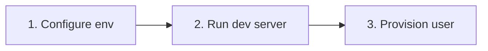
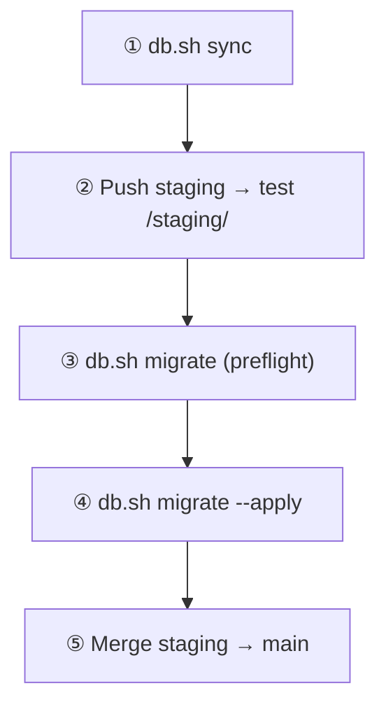

# Documentation Hub

> **Interactive docs:** open **[index.html](index.html)** in your browser — search, command palette (⌘K), release pipeline, and markdown viewer.  
> This file is the plain-text fallback.

> **Bishnupriya Fuels** — run locally, deploy safely, and maintain production.

---

## At a glance

| | |
|---|---|
| **Stack** | Static HTML/JS · Supabase (Postgres + Auth + RLS) · GitHub Pages |
| **Environments** | **Prod** → `main` branch · **Staging** → `staging` branch (`/staging/`) |
| **Roles** | `admin` (full) · `supervisor` (operations, no settings/reports/staff) |
| **Canonical schema** | `supabase/schema.sql` |

---

## Start here — 3 steps



| Step | What to do | Time |
|------|------------|------|
| **1. Configure** | `cp js/env.example.js js/env.js` → paste Supabase URL + anon key | ~2 min |
| **2. Run** | `npm run dev` → open [http://localhost:4173](http://localhost:4173) | ~1 min |
| **3. Login** | Create user in Supabase Auth **and** add row in `public.users` | ~3 min |

<details>
<summary><strong>Step 1 — Configure Supabase credentials (expand)</strong></summary>

1. Copy the example config:
   ```bash
   cp js/env.example.js js/env.js
   ```
2. Edit `js/env.js`:
   ```javascript
   window.__APP_CONFIG__ = {
     SUPABASE_URL: "https://your-project-id.supabase.co",
     SUPABASE_ANON_KEY: "your-anon-key-here",
     APP_ENV: "development",
   };
   ```
3. Find values in Supabase → **Project Settings → API** (Project URL + anon key).
4. Apply schema: run `supabase/schema.sql` in SQL Editor, **or** apply migrations from `supabase/migrations/` in filename order.

**Expected result:** App can connect to your Supabase project without CORS errors.

</details>

<details>
<summary><strong>Step 2 — Run the dev server (expand)</strong></summary>

**Recommended** (builds partials, mirrors production):

```bash
npm run dev
```

Open **http://localhost:4173/**

**Alternative** (quick static serve):

```bash
npm run build:site   # optional
python3 -m http.server 3000
```

Open **http://localhost:3000/** → `login.html`

**Tip:** If assets look stale, hard-refresh or unregister the service worker (`sw.js`).

</details>

<details>
<summary><strong>Step 3 — First login & provision user (expand)</strong></summary>

Supabase Auth alone is **not enough**. Both steps are required:

1. **Supabase Auth** — Authentication → Users → create email/password user.
2. **`public.users`** — add matching email with role:

   ```sql
   insert into public.users (email, role)
   values ('you@example.com', 'admin')
   on conflict (email) do update set role = 'admin';
   ```

**Greenfield:** First signed-in user can self-provision as admin via **Settings → Users** (own email only, role `admin`).

**Unprovisioned users** see empty data — RLS blocks access without a `public.users` row.

Full guide: [Development → First login](DEVELOPMENT.md#14-first-login)

</details>

---

## Quick access — by how often you need it

### Daily & weekly

| Task | Go to | Command / action |
|------|-------|-------------------|
| **Run app locally** | [§ Start here](#start-here--3-steps) | `npm run dev` |
| **Deploy to staging** | [Deploy to staging ↓](#deploy-to-staging) | Push `staging` branch or manual workflow |
| **Test a feature branch on staging** | [Deploy to staging ↓](#deploy-to-staging) | Actions → Deploy → target `staging` |
| **Add a supervisor** | [Add operator ↓](#add-a-supervisor-operator) | Settings → Users or SQL |
| **Understand a page / flow** | [Flows](FLOWS.md) | Page → data mapping |

### Release & maintenance

| Task | Go to | Command / action |
|------|-------|-------------------|
| **Ship a release (full workflow)** | [Release workflow ↓](#release-workflow-ship-to-production) | sync → test → migrate → deploy |
| **Copy prod data to staging** | [DB sync ↓](#db-sync-prod--staging) | `./scripts/db.sh sync` |
| **Check migrations (safe)** | [DB migrate ↓](#db-migrate-preflight) | `./scripts/db.sh migrate` |
| **Apply prod schema** | [DB migrate ↓](#db-migrate-apply-production) | `./scripts/db.sh migrate --apply` |
| **Backup prod locally** | [DB backup ↓](#db-backup-local) | `./scripts/db.sh backup` |
| **Deploy to production** | [Deploy to prod ↓](#deploy-to-production) | Merge `staging` → `main` |

### One-time setup

| Task | Guide |
|------|-------|
| Google Drive for supplier invoices | [Invoice documents](INVOICE_DOCUMENTS.md) |
| Monthly prod backup → Google Drive | [Backup guide](BACKUP.md) |
| GitHub Pages + environment secrets | [Development → Deployment](DEVELOPMENT.md#2-deployment-prod-and-staging) |
| DB script credentials | [scripts/README.md](../scripts/README.md#one-time-setup) |

### Reference (look up when coding)

| Topic | Document |
|-------|----------|
| Project structure, security, stack | [Architecture](ARCHITECTURE.md) |
| Tables, columns, RLS, RPCs | [Data tables](DATA_TABLES.md) |
| DSR model (`dsr_petrol`, `dsr_diesel`, stock) | [DSR tables](DSR_TABLES.md) |
| End-to-end user & data flows | [Flows](FLOWS.md) |

---

## Essential commands — step by step

> **One-time DB setup:** `cp scripts/db.env.example scripts/db.env` — add `PROD_DB_URL` and `STAGING_DB_URL` from Supabase → Connect → Session pooler.  
> Full script reference: [scripts/README.md](../scripts/README.md)

### Deploy to staging

**When:** Testing changes before production. **Frequency:** Several times per week.

| | |
|---|---|
| **Trigger** | Push to `staging` **or** manual GitHub Actions workflow |
| **URL** | `https://bishnupriyafuels.fnsventures.in/staging/` |
| **Writes prod?** | No |

**Option A — Push branch (automatic)**

1. Merge or push your branch into `staging`.
2. GitHub Actions runs **Deploy** workflow automatically.
3. Wait ~1–2 min, then open `/staging/` and smoke-test.

**Option B — Manual deploy from any branch**

1. GitHub → **Actions** → **Deploy** → **Run workflow**.
2. **Use workflow from** — pick branch (e.g. `feature/my-change`).
3. **target** — `staging`.
4. **ref** *(optional)* — specific commit SHA; leave empty for branch HEAD.
5. Verify on `/staging/`.

**Prerequisites:** `staging` environment secrets: `SUPABASE_URL`, `SUPABASE_ANON_KEY`.

---

### Deploy to production

**When:** Staging is verified. **Frequency:** Per release.

| | |
|---|---|
| **Trigger** | Push to `main` **or** manual workflow with target `prod` |
| **URL** | `https://bishnupriyafuels.fnsventures.in/` |
| **Writes prod DB?** | No (frontend only — schema changes are separate) |

1. Confirm staging tests pass on `/staging/`.
2. Merge `staging` → `main` (or run **Deploy** manually, target `prod`, from `main`).
3. Wait for workflow to finish.
4. Smoke-test live site: login, dashboard, one operational page.

**If release includes DB migrations:** run [migrate --apply](#db-migrate-apply-production) **before or during** the quiet window, not after users are entering DSR data.

---

### Release workflow (ship to production)

**When:** Shipping app + schema changes. **Frequency:** Per release.



| Step | Command | Prod | Staging |
|------|---------|------|---------|
| 1. Real data for testing | `./scripts/db.sh sync` | read only | data replaced |
| 2. Test app | push `staging` → auto-deploy | — | updated |
| 3. Preflight | `./scripts/db.sh migrate` | no changes | — |
| 4. Migrate schema | `./scripts/db.sh migrate --apply` | schema upgraded | — |
| 5. Deploy frontend | merge `staging` → `main` | site updated | — |

**Optional before step 4:** `./scripts/db.sh backup` or Supabase Dashboard backup.

**Quiet window:** Run step 4 when no one is entering DSR or day-closing data.

Detail: [scripts/README.md → Release workflow](../scripts/README.md#release-workflow)

---

### DB sync (prod → staging)

**When:** Before testing a release with real data. **Frequency:** Every release.

```bash
./scripts/db.sh sync
```

| Step | What happens |
|------|--------------|
| 1 | Stamps staging migrations + `db push` (schema on staging) |
| 2 | Dumps prod auth, public, storage |
| 3 | Truncates staging |
| 4 | Loads dumps; splits legacy `dsr` if needed |

| | |
|---|---|
| **Writes prod?** | No (read only) |
| **Writes staging?** | Yes — **replaces all staging data** |
| **Output** | `scripts/.sync-dumps/` (gitignored) |
| **Not copied** | Storage file bytes, session tokens, edge secrets |

**Prerequisites:** Docker running (or `libpq`), `scripts/db.env` configured.

---

### DB migrate (preflight)

**When:** Before applying schema to prod. **Frequency:** Every release with migrations.

```bash
./scripts/db.sh migrate
```

| | |
|---|---|
| **Writes prod?** | **No** — safe to run anytime |
| **Shows** | Migration status, dry-run, pending files |

Review output. If it looks correct, proceed to [migrate --apply](#db-migrate-apply-production).

---

### DB migrate --apply (production)

**When:** Staging verified, preflight reviewed. **Frequency:** Per schema release.

```bash
./scripts/db.sh migrate --apply
```

| Step | What happens |
|------|--------------|
| 1 | Preflight SQL + migration counts |
| 2 | Dry-run |
| 3 | Backup → `scripts/.prod-backups/` |
| 4 | `supabase db push` on prod |
| 5 | Verification SQL + DSR count snapshot |

| | |
|---|---|
| **Writes prod?** | **Yes** (schema only) |
| **Run during** | Quiet window — no active DSR / day closing |

**Do not** run `stamp-staging-migrations.sql` on prod.

---

### DB backup (local)

**When:** Before `migrate --apply` or ad-hoc safety copy. **Frequency:** Before risky changes.

```bash
./scripts/db.sh backup
```

| | |
|---|---|
| **Writes prod?** | No |
| **Output** | `scripts/.prod-backups/` |
| **Files** | `prod-schema-*.sql`, `prod-data-*.sql`, `dsr-counts-snapshot-*.txt` |

**Off-site backup:** Monthly Google Drive upload — [Backup guide](BACKUP.md).

---

### Add a supervisor (operator)

**When:** New forecourt operator needs app access. **Frequency:** As needed.

1. **Supabase Auth** — create user (email + password).
2. **Provision role** — admin adds via **Settings → Users**, or SQL:

   ```sql
   insert into public.users (email, role)
   values ('operator@example.com', 'supervisor')
   on conflict (email) do update set role = 'supervisor';
   ```

3. **Login** — operator signs in at `login.html`.

**Supervisor can access:** dashboard, DSR, credit, expenses, day closing, billing, invoices, attendance, salary.

**Supervisor cannot access:** staff roster, analysis, reports, settings.

Detail: [Development → Supervisor login](DEVELOPMENT.md#3-supervisor--operator-login)

---

## Cheat sheet

| Goal | Command |
|------|---------|
| Run locally | `npm run dev` |
| Build site mirror | `npm run build:site` |
| Sync prod → staging | `./scripts/db.sh sync` |
| Preflight migrations | `./scripts/db.sh migrate` |
| Apply prod migrations | `./scripts/db.sh migrate --apply` |
| Local prod backup | `./scripts/db.sh backup` |
| All DB commands | `./scripts/db.sh help` |
| Deploy edge functions (manual) | `supabase functions deploy <name> --project-ref REF` |

---

## Documentation index

| Document | Best for |
|----------|----------|
| [**Architecture**](ARCHITECTURE.md) | Stack, folder layout, security model, deployment overview |
| [**Flows**](FLOWS.md) | How features connect; page → table mapping |
| [**Development**](DEVELOPMENT.md) | Full local setup, GitHub secrets, edge functions, deployment detail |
| [**Data tables**](DATA_TABLES.md) | Database reference: tables, RLS, RPCs |
| [**DSR tables**](DSR_TABLES.md) | Meter readings, stock reconciliation, `get_dsr_stock_range` |
| [**Invoice documents**](INVOICE_DOCUMENTS.md) | Supplier PDFs + Google Drive (one-time setup) |
| [**Backup**](BACKUP.md) | Monthly prod DB → Google Drive, restore, troubleshooting |
| [**scripts/README**](../scripts/README.md) | DB scripts internals, troubleshooting, file reference |

---

## Paths by role

| You are… | Start with | Then use |
|----------|------------|----------|
| **New developer** | [Start here](#start-here--3-steps) → [Architecture](ARCHITECTURE.md) | [Flows](FLOWS.md), [Data tables](DATA_TABLES.md) |
| **Shipping a release** | [Release workflow](#release-workflow-ship-to-production) | [scripts/README](../scripts/README.md), [Development § Deploy](DEVELOPMENT.md#2-deployment-prod-and-staging) |
| **Station admin** | [Add supervisor](#add-a-supervisor-operator) | [Flows § Daily ops](FLOWS.md#2-daily-operations-flow) |
| **Schema / billing / reports work** | [Data tables](DATA_TABLES.md) | [DSR tables](DSR_TABLES.md), [Flows](FLOWS.md) |
| **HR features** | [Flows §7 HR](FLOWS.md#7-hr-flow-staff-attendance-salary) | [Data tables → employees](DATA_TABLES.md#employees) |

---

## Conventions

- **Single source of truth:** Structure → [Architecture](ARCHITECTURE.md). Setup/deploy detail → [Development](DEVELOPMENT.md). Schema → `supabase/schema.sql`.
- **Cross-links:** Each deep doc ends with “Related documentation”.
- **Root README:** Project overview and feature list — links here for all operational steps.
