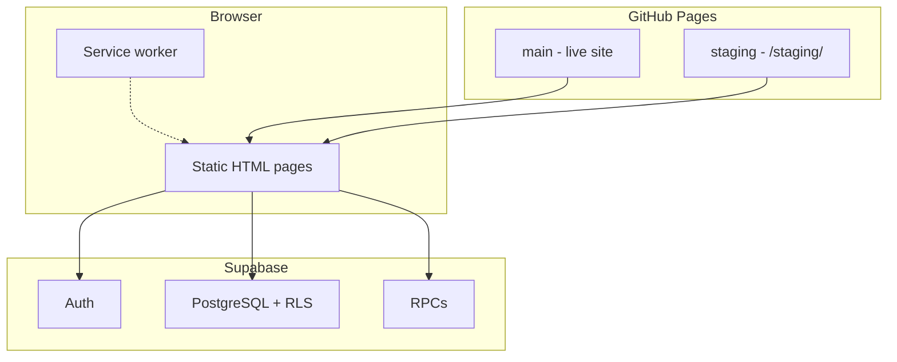
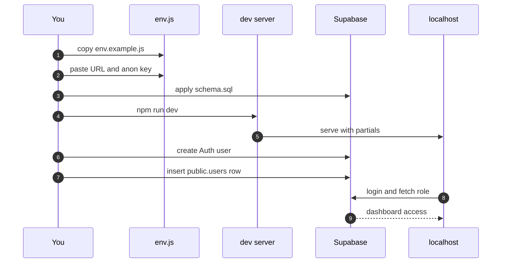
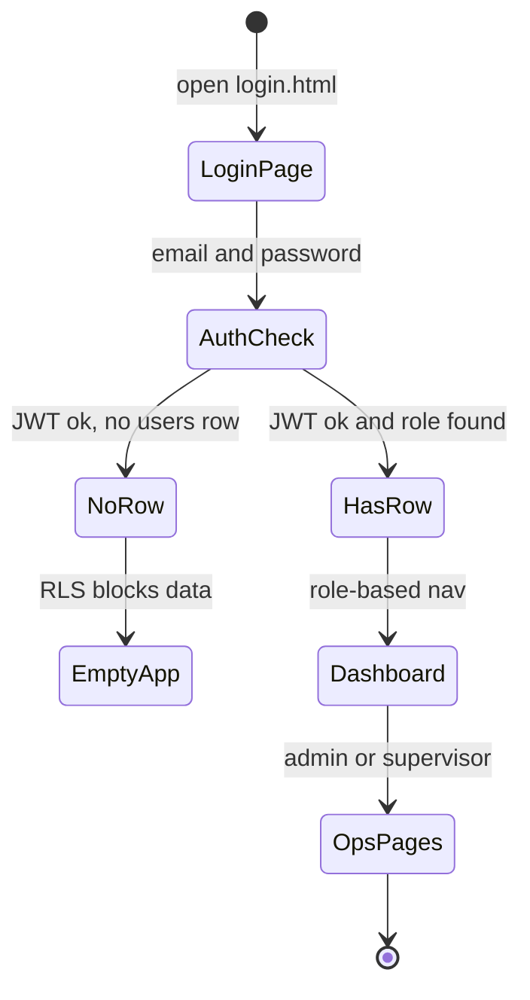
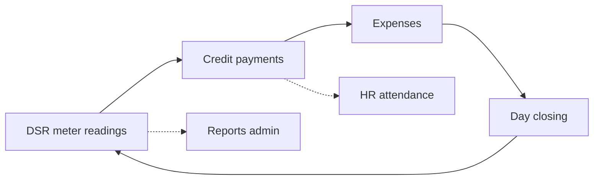
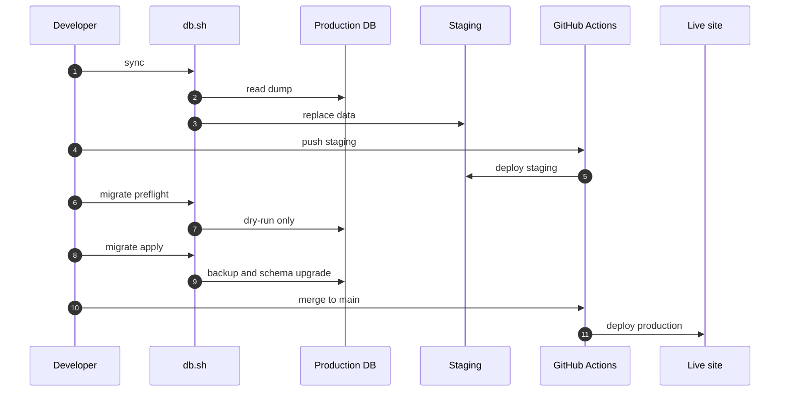
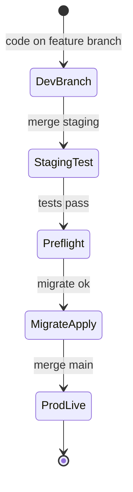
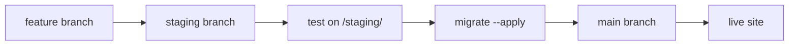

<div align="center">

# ⛽ Documentation Hub

### *Everything you need — right here on GitHub.*

**Bishnupriya Fuels** · run locally · deploy safely · ship with confidence

<br />


<br />

**Jump to:**

[🚀 Quick start](#-quick-start) ·
[🎬 Visual guides](#-visual-guides) ·
[⚡ Daily tasks](#-daily--weekly) ·
[🛰️ Release](#-release--maintenance) ·
[📟 Commands](#-command-recipes) ·
[🗂️ Library](#-documentation-library) ·
[👋 Pick your path](#-pick-your-path)

<br />

<sub>All docs live in this repo — no external site, no extra login. Just browse, copy, and go.</sub>

</div>

---

> [!TIP]
> **New here?** Start with [Quick start](#-quick-start) — you'll be running the app in about 5 minutes.  
> **Shipping today?** Jump straight to [Release workflow](#-release-workflow-ship-to-production).

---

## 🌐 System snapshot

| | |
|:--|:--|
| **What it is** | Petrol pump ops app — DSR, credit, billing, HR, reports |
| **Stack** | Static HTML/JS · Supabase (Postgres + Auth + RLS) · GitHub Pages |
| **Production** | `main` branch → live site root |
| **Staging** | `staging` branch → `/staging/` preview |
| **Who can do what** | `admin` (full) · `supervisor` (day-to-day ops, no settings/reports/staff) |
| **Source of truth** | `supabase/schema.sql` |

### How the pieces connect



---

## 🎬 Visual guides

*Futuristic animated SVG flows — use the **raw GitHub URLs** below so SMIL animation plays in the rendered README (relative `./assets/` paths get flattened by GitHub’s image proxy).*

| Guide | What it shows | Jump to |
|:--|:--|:--|
| Quick start flow | Configure → Run → Provision | [below ↓](#-quick-start) |
| Login & access | Auth + `public.users` decision | [step 3 ↓](#-quick-start) |
| Daily ops loop | DSR → credit → expenses → close | [Flows →](FLOWS.md) |
| Deploy path | `feature` → `staging` → `main` | [commands ↓](#-command-recipes) |
| Release pipeline | 5-step ship-to-prod sequence | [release ↓](#-release-workflow-ship-to-production) |

<p align="center">
  
</p>

---

## 🚀 Quick start

> *You're three steps away from a running app on your machine.*  
> *See the animated diagram in [Visual guides](#-visual-guides) above.*



| | Step | What you'll do | ~Time |
|:--:|:--|:--|:--:|
| ⚙️ | **Configure** | Copy `js/env.js` and paste your Supabase keys | 2 min |
| ▶️ | **Run** | `npm run dev` → open `http://localhost:3000` | 1 min |
| 👤 | **Provision** | Create Auth user **and** a `public.users` row | 3 min |

<details>
<summary>⚙️ <strong>Step 1 — Configure Supabase</strong> <em>(click to expand)</em></summary>

<br />

First, copy the example config:

```bash
cp js/env.example.js js/env.js
```

Then open `js/env.js` and fill in your project details:

```javascript
window.__APP_CONFIG__ = {
  SUPABASE_URL: "https://your-project-id.supabase.co",
  SUPABASE_ANON_KEY: "your-anon-key-here",
  APP_ENV: "development",
};
```

| Where to look | What you need |
|:--|:--|
| Supabase → **Project Settings → API** | Project URL + anon key |
| Supabase → **SQL Editor** | Run `supabase/schema.sql` or migrations in order |

> [!NOTE]
> **Done when:** The app loads without CORS errors and can reach your Supabase project.

</details>

<details>
<summary>▶️ <strong>Step 2 — Start the dev server</strong> <em>(click to expand)</em></summary>

<br />

**Recommended** — builds nav partials, same as production:

```bash
npm run dev
```

Open → **http://localhost:3000/**

**Quick alternative:**

```bash
npm run build:site   # optional
python3 -m http.server 8080
```

Open → **http://localhost:8080/login.html**

> [!TIP]
> Page looks outdated? Hard-refresh, or unregister the service worker (`sw.js`).

</details>

<details>
<summary>👤 <strong>Step 3 — Set up your first login</strong> <em>(click to expand)</em></summary>

<br />

> [!IMPORTANT]
> Supabase Auth **alone is not enough.** You need **both** steps below — otherwise you'll sign in but see empty screens (RLS blocks unprovisioned users).

**① Create the Auth user**  
Supabase → Authentication → Users → add email + password

**② Add the app user row**

```sql
insert into public.users (email, role)
values ('you@example.com', 'admin')
on conflict (email) do update set role = 'admin';
```

| Situation | What happens |
|:--|:--|
| 🌱 **Brand-new project** | First signed-in user can self-provision as `admin` via Settings → Users |
| ⚠️ **No `public.users` row** | Login works, but every page shows empty data |

→ More detail: [Development → First login](DEVELOPMENT.md#14-first-login)

</details>

#### Login flow — what happens when someone signs in

<p align="center">
  
</p>



---

## ⚡ Quick access

*Grouped by how often you'll need each task — pin this section.*

### 🟢 Daily & weekly

| I want to… | Do this | |
|:--|:--|:--:|
| Run the app on my machine | `npm run dev` |  |
| Deploy to staging for testing | Push `staging` or [manual deploy ↓](#deploy-to-staging) |  |
| Add a forecourt operator | [Add supervisor ↓](#add-a-supervisor-operator) | when needed |
| Understand how a page works | [Flows →](FLOWS.md) | reference |

### 🟡 Release & maintenance

| I want to… | Do this | |
|:--|:--|:--:|
| **Ship a full release** | Follow the [pipeline ↓](#-release-workflow-ship-to-production) |  |
| Test with real prod data on staging | `./scripts/db.sh sync` |  |
| Check migrations safely (no prod changes) | `./scripts/db.sh migrate` |  |
| Apply schema to production | `./scripts/db.sh migrate --apply` |  |
| Back up prod before something risky | `./scripts/db.sh backup` | before ops |
| Go live with the frontend | Merge `staging` → `main` |  |

### 🔵 One-time setup

| I want to… | Guide |
|:--|:--|
| Store supplier invoice PDFs in Google Drive | [Invoice documents →](INVOICE_DOCUMENTS.md) |
| Automate monthly prod backups to Drive | [Backup guide →](BACKUP.md) |
| Configure GitHub Pages + secrets | [Development → Deployment](DEVELOPMENT.md#2-deployment-prod-and-staging) |
| Set up DB script credentials | [scripts/README →](../scripts/README.md#one-time-setup) |

### 📖 Reference (while coding)

| I need to look up… | Open |
|:--|:--|
| Folders, security, how it all fits | [Architecture](ARCHITECTURE.md) |
| Tables, columns, RLS, RPCs | [Data tables](DATA_TABLES.md) |
| DSR / meter readings / stock | [DSR tables](DSR_TABLES.md) |
| User journeys & page → data mapping | [Flows](FLOWS.md) |

#### Daily operations at the forecourt

<p align="center">
  
</p>



---

## 🛰️ Release workflow (ship to production)

*The safe path — follow these five steps in order.*

<p align="center">
  
</p>





| # | What | Command | Prod | Staging |
|:-:|:--|:--|:--|:--|
| ① | Copy real data for testing | `./scripts/db.sh sync` | read only | **replaced** |
| ② | Test the app | push `staging` | — | auto-deployed |
| ③ | Review migrations (safe) | `./scripts/db.sh migrate` | no changes | — |
| ④ | Upgrade prod schema | `./scripts/db.sh migrate --apply` | schema updated | — |
| ⑤ | Ship the frontend | merge `staging` → `main` | site live | — |

> [!WARNING]
> Run step ④ during a **quiet window** — when no one is entering DSR or day-closing data.

> [!TIP]
> Before step ④, consider `./scripts/db.sh backup` or a Supabase Dashboard backup. Better safe than sorry.

→ Full detail: [scripts/README → Release workflow](../scripts/README.md#release-workflow)

---

## 📟 Command recipes

*Copy-paste ready. Expand only what you need.*

#### How code reaches production

<p align="center">
  
</p>



> [!NOTE]
> **One-time DB setup:** `cp scripts/db.env.example scripts/db.env` — add `PROD_DB_URL` and `STAGING_DB_URL` from Supabase → Connect → Session pooler.

---

<details>
<summary>

### 🚀 Deploy to staging

 

</summary>

<br />

| | |
|:--|:--|
| **Where it goes** | `/staging/` |
| **How to trigger** | Push `staging` **or** Actions → Deploy → target `staging` |

**Automatic (easiest)**

1. Merge or push your branch into `staging`
2. Wait ~1–2 min for GitHub Actions
3. Open `/staging/` and click through your changes

**Manual (any branch)**

1. GitHub → **Actions** → **Deploy** → **Run workflow**
2. **Use workflow from** — pick your branch
3. **target** → `staging`
4. **ref** *(optional)* — specific commit; leave empty for latest

**You'll need:** `staging` environment secrets → `SUPABASE_URL`, `SUPABASE_ANON_KEY`

</details>

<details>
<summary>

### 🌍 Deploy to production

 

</summary>

<br />

| | |
|:--|:--|
| **Where it goes** | Live site root |
| **How to trigger** | Push `main` **or** manual Deploy → target `prod` |

1. ✅ Staging looks good on `/staging/`
2. Merge `staging` → `main`
3. Wait for the workflow to finish
4. Smoke-test: login → dashboard → one real page (e.g. DSR)

> [!IMPORTANT]
> If this release includes **database migrations**, run [migrate --apply](#db-migrate-apply-production) during a quiet window **before** operators start entering live data.

</details>

<details>
<summary>

### 🔄 DB sync — prod → staging

 

</summary>

<br />

```bash
./scripts/db.sh sync
```

| Step | What happens behind the scenes |
|:--:|:--|
| 1 | Stamps staging migrations + updates schema |
| 2 | Dumps prod (auth, public, storage) |
| 3 | Clears staging |
| 4 | Loads dumps; splits legacy `dsr` if needed |

**Needs:** `scripts/db.env` configured, Docker running (or `libpq`)  
**Output:** `scripts/.sync-dumps/` (gitignored — don't commit)  
**Not copied:** photo files, session tokens, edge function secrets

</details>

<details>
<summary>

### 🔍 DB migrate — preflight (safe)


</summary>

<br />

```bash
./scripts/db.sh migrate
```

Shows migration status and a dry-run. **No production changes.** Run this anytime you're curious or before a release.

When the output looks right → proceed to [migrate --apply](#db-migrate-apply-production).

</details>

<details>
<summary>

### ⚡ DB migrate --apply — production


</summary>

<br />

```bash
./scripts/db.sh migrate --apply
```

| Step | What happens |
|:--:|:--|
| 1 | Preflight checks + migration count |
| 2 | Dry-run review |
| 3 | Auto-backup → `scripts/.prod-backups/` |
| 4 | `supabase db push` on production |
| 5 | Verification + DSR row snapshot |

> [!CAUTION]
> **Quiet window only.** Never run `stamp-staging-migrations.sql` on prod.

</details>

<details>
<summary>

### 💾 DB backup — local copy


</summary>

<br />

```bash
./scripts/db.sh backup
```

Saves to `scripts/.prod-backups/`:

- `prod-schema-*.sql`
- `prod-data-*.sql`
- `dsr-counts-snapshot-*.txt`

For off-site monthly backups → [Backup guide](BACKUP.md)

</details>

<details>
<summary>

### 👤 Add a supervisor (operator)

</summary>

<br />

A friendly checklist for onboarding a new forecourt operator:

- [ ] Create user in **Supabase Auth** (email + password)
- [ ] Add role in **Settings → Users** (admin), or run:

```sql
insert into public.users (email, role)
values ('operator@example.com', 'supervisor')
on conflict (email) do update set role = 'supervisor';
```

- [ ] Operator signs in at `login.html`

| ✅ They can use | 🚫 They cannot use |
|:--|:--|
| dashboard, DSR, credit, expenses, day closing, billing, invoices, attendance, salary | staff roster, analysis, reports, settings |

→ [Development → Supervisor login](DEVELOPMENT.md#3-supervisor--operator-login)

</details>

---

## 📋 Cheat sheet

*Keep this table handy — every command in one glance.*

| I want to… | Run this |
|:--|:--|
| Run locally | `npm run dev` |
| Build a production-like mirror | `npm run build:site` |
| Copy prod data to staging | `./scripts/db.sh sync` |
| Check migrations (safe) | `./scripts/db.sh migrate` |
| Apply prod migrations | `./scripts/db.sh migrate --apply` |
| Back up prod locally | `./scripts/db.sh backup` |
| See all DB commands | `./scripts/db.sh help` |
| Deploy an edge function | `supabase functions deploy <name> --project-ref REF` |

---

## 🗂️ Documentation library

| Doc | Open when you need… |
|:--|:--|
| [**Architecture**](ARCHITECTURE.md) | How the project is organised, security model, deployment |
| [**Flows**](FLOWS.md) | End-to-end journeys — which page writes which table |
| [**Development**](DEVELOPMENT.md) | Full setup, GitHub secrets, edge functions |
| [**Data tables**](DATA_TABLES.md) | Every table, column, RLS rule, and RPC |
| [**DSR tables**](DSR_TABLES.md) | Meter readings, petrol/diesel split, stock math |
| [**Invoice documents**](INVOICE_DOCUMENTS.md) | Google Drive for supplier PDFs (one-time) |
| [**Backup**](BACKUP.md) | Monthly Drive backup, restore, troubleshooting |
| [**scripts/README**](../scripts/README.md) | DB script internals and error fixes |

---

## 👋 Pick your path

*Not sure where to start? Choose the row that sounds like you.*

| You are… | Start here | Then explore |
|:--|:--|:--|
| 🧑‍💻 **New to the project** | [Quick start](#-quick-start) → [Architecture](ARCHITECTURE.md) | [Flows](FLOWS.md) · [Data tables](DATA_TABLES.md) |
| 🚀 **Shipping a release today** | [Release workflow](#-release-workflow-ship-to-production) | [scripts/README](../scripts/README.md) · [Development § Deploy](DEVELOPMENT.md#2-deployment-prod-and-staging) |
| 🏪 **Station admin / manager** | [Add supervisor](#add-a-supervisor-operator) | [Flows § Daily ops](FLOWS.md#2-daily-operations-flow) |
| 🗄️ **Working on schema or billing** | [Data tables](DATA_TABLES.md) | [DSR tables](DSR_TABLES.md) · [Flows](FLOWS.md) |
| 👥 **Working on HR features** | [Flows §7 HR](FLOWS.md#7-hr-flow-staff-attendance-salary) | [Data tables → employees](DATA_TABLES.md#employees) |

---

## 📌 Conventions

| Topic | Single source of truth |
|:--|:--|
| Project structure | [Architecture](ARCHITECTURE.md) |
| Setup & deploy detail | [Development](DEVELOPMENT.md) |
| Database schema | `supabase/schema.sql` |
| This hub | You're reading it |

Each deep doc ends with **Related documentation** links back to siblings.

---

<div align="center">

<br />

**Questions?** Open the relevant doc above, or check [Development](DEVELOPMENT.md) for troubleshooting.

<sub>Bishnupriya Fuels · A F&S Ventures Company · docs live on GitHub — always in sync with the code</sub>

</div>
